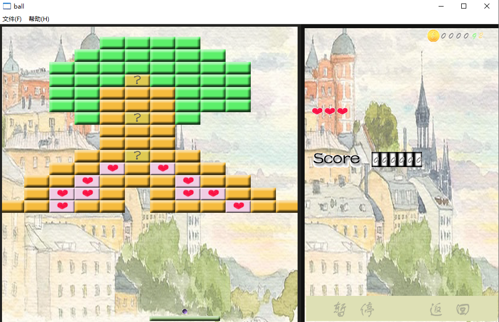
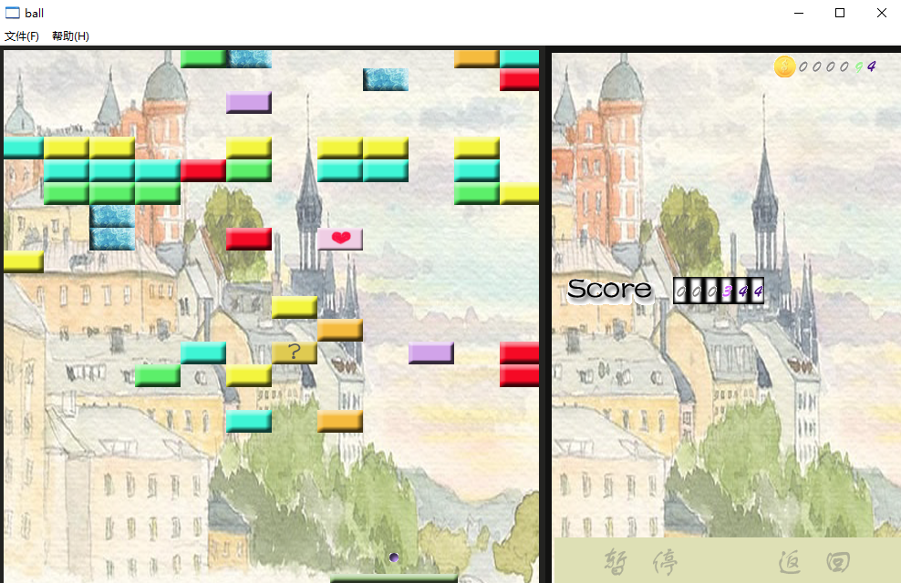
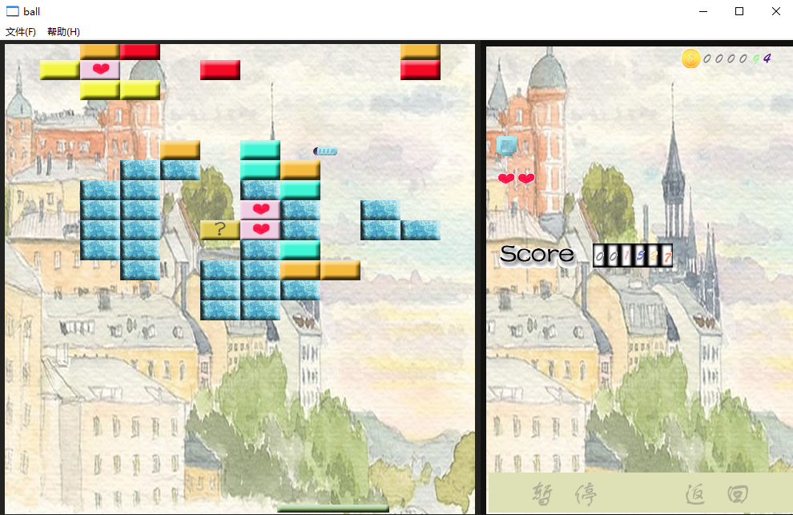
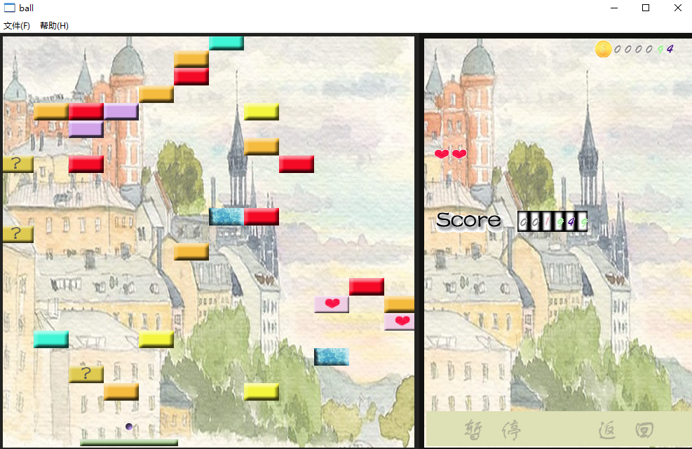
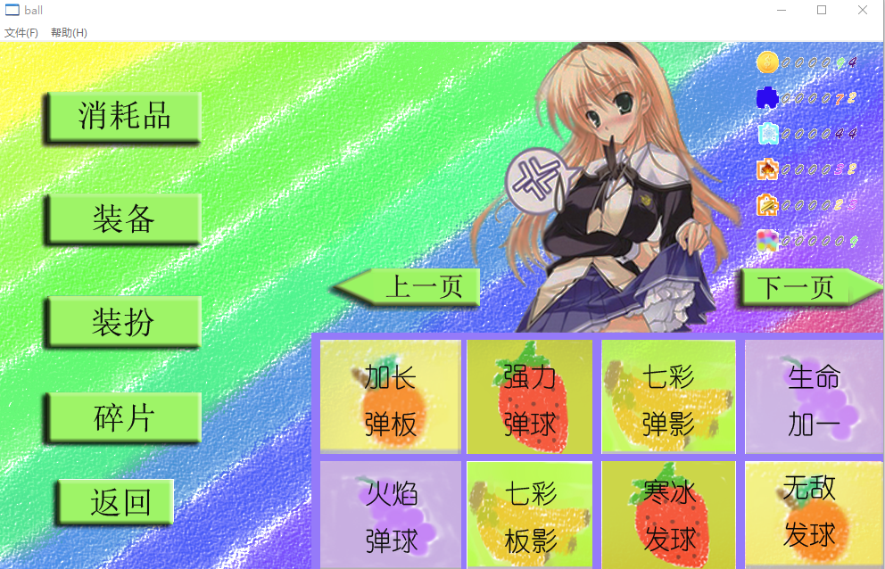

# 弹球游戏

这是一款基于WIN32 API实现的弹球游戏，支持冒险模式、重力模式、试炼模式、生存模式。

## QuickStart

**在Windows系统下：**

运行`Test/ball.exe` 可直接运行示例

**编译方法：**

将`OpenGL-Final.sln`导入VS2015打开项目并编译

## 简介

### 冒险模式

玩家在冒险模式中进行闯关

### 试炼模式

在试炼模式中，玩家处理接连不断的方块以提升技术

### 重力模式

在重力模式中，弹球将以抛物线的轨迹运动

### 生存模式

生存模式是试炼模式的升级版，砖块将在更低的地方刷新

### 游戏商店

玩家可以在游戏商店购买强力道具

